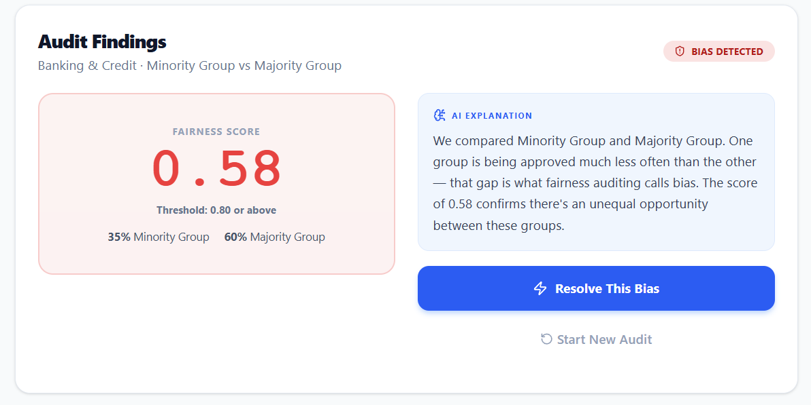
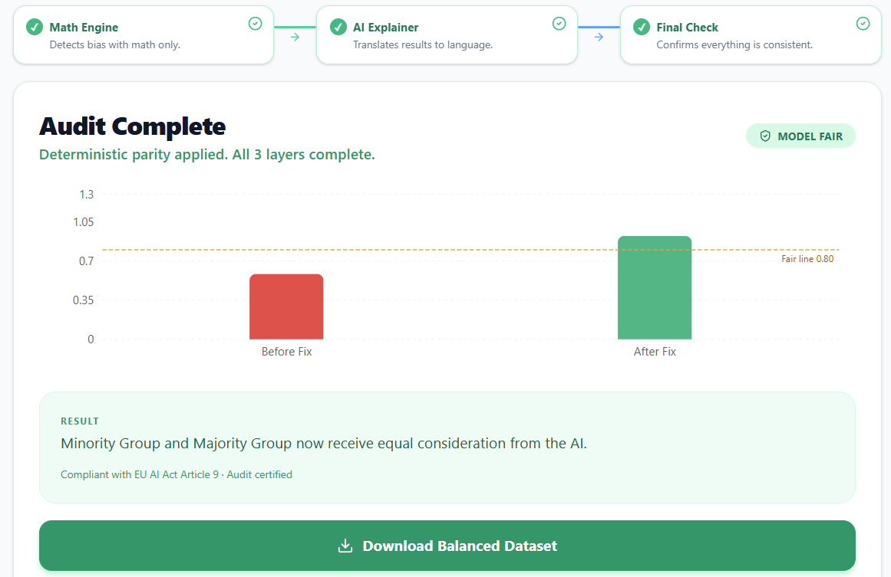

# TrustOS 🛡️
### *AI Fairness Audit Engine*

> **"Is your AI treating everyone fairly? Now you can prove it."**

AI systems decide who gets hired, who gets a loan, who receives medical care.  
If the data they learned from was unfair — the AI will be unfair too.

**TrustOS finds that hidden unfairness. Measures it. And fixes it.**  
No guesswork. No black boxes. Just math.

---

## 🎯The Mission
 
AI systems now make life-changing decisions —  
who gets **hired**, who gets a **loan**, who receives **medical care**.

These systems learn from historical data.  
If that history is unfair — the AI repeats and amplifies those exact same mistakes.

**TrustOS gives organizations one simple thing:**  
A clear, accessible way to **find**, **measure**, and **fix** hidden bias —  
before their AI impacts real people.

**The Core Paradox:**
> *"If your bias detection system uses an AI model, and that model is biased — isn't your solution also biased?"*

**The Answer:**
> We separate the *detection layer* from the *explanation layer* completely. Bias is detected using deterministic statistical formulas — no AI, no learning, no hallucination risk. AI is only used to explain what the math means in plain English. Even if the explanation model has flaws, it has **zero influence** on whether bias is detected or not.
>
> **The math is the judge. The AI is just the translator.**

---

---

## 📸 Screenshots

<div align="center">

<table>
  <tr>
    <td align="center" width="50%">
      
      <br />
      <sub><b>Audit Dashboard — Bias Score & Visual Report</b></sub>
    </td>
    <td align="center" width="50%">
      
      <br />
      <sub><b>Parity Lock — Mitigated Dataset & Proof of Parity</b></sub>
    </td>
  </tr>
</table>

</div>

---

## 🏗️ The 3-Layer Architecture

The entire system is built on a tiered structure that ensures mathematical accuracy, human readability, and regulatory compliance — in that order.

```
[ Raw Dataset ]
      │
      ▼
┌─────────────────────────────┐
│  LAYER 1 — Math Engine      │  ← Pure deterministic math. Zero AI. Irrefutable.
│  Disparate Impact Ratio     │
│  + 3 cross-check metrics    │
└─────────────┬───────────────┘
              │  Score: 0.64
              ▼
┌─────────────────────────────┐
│  LAYER 2 — AI Explainer     │  ← Gemini 2.0 Flash. Explains results. Never decides them.
│  "The system is 36% biased  │
│   against women."           │
└─────────────┬───────────────┘
              │
              ▼
┌─────────────────────────────┐
│  LAYER 3 — Parity Lock      │  ← Reweighting algorithm. Generates Proof of Parity.
│  Mitigated CSV + Certificate│
└─────────────────────────────┘
```

### Layer 1 — The Math Engine *(Objective Truth)*
- Uses the **Disparate Impact Ratio** — a globally recognized legal standard
- Formula: `Minority approval rate ÷ Majority approval rate`
- If result `< 0.80` → **BIAS DETECTED** (the 80% Rule, used by EEOC and EU AI Act)
- Runs **4 independent metrics in parallel** — all must agree before flagging is resolved
- **AI is strictly locked out of this layer**

| Metric | Role |
|---|---|
| Disparate Impact Ratio | Core 80% rule check |
| Demographic Parity Difference | Outcome gap between groups |
| Equalized Odds Gap | Error rate fairness check |
| Statistical Significance Test | Confirms findings aren't random noise |

**Conflict resolution rule:** Majority of metrics flag bias → system flags bias. AI never overrides a metric result. Ever.

### Layer 2 — The AI Explainer *(Human Context)*
- Powered by **Gemini 2.0 Flash**
- Takes the raw number from Layer 1 and translates it into plain, empathetic language
- Example: `0.50` → *"Male applicants are approved at twice the rate of female applicants for equivalent qualifications. This fails the 80% rule."*
- If AI explanation contradicts the math: **math wins**

### Layer 3 — The Parity Lock *(Compliance)*
- Uses **mathematical reweighting** — not deletion — to balance the dataset
- Preserves the value of the original data while achieving statistical parity
- Outputs a new, balanced CSV and a **"Proof of Parity" certificate** ready for regulatory submission

---

## ⚖️ Why This Architecture is Bulletproof

| Type 1 System *(what others build)* | Type 2 System *(what this is)* |
|---|---|
| AI decides fairness | Math decides fairness |
| No explanation | Full audit trail |
| No audit capability | Fully transparent |
| Judges and regulators reject it | Judges and regulators respect it |

Think of it like a courtroom:
- ⚖️ **The Math Engine** = The Judge — makes the actual decision based on facts
- ✦ **Gemini AI** = The Lawyer — translates the ruling into plain language
- ◈ **The System** = The Courtroom — built so both can work together

---

## 🌍 15 Real-World Audit Scenarios

Paradox Conscience is pre-configured for 15 high-impact sectors where AI bias causes the most harm:

| # | Sector | What It Audits |
|---|---|---|
| 1 | **Hiring** | Automated resume screening for gender or racial bias |
| 2 | **Banking** | Discrimination in credit scoring and loan approvals |
| 3 | **Healthcare** | Gaps in medical treatment plans based on demographics |
| 4 | **Education** | University admissions for fairness |
| 5 | **Prison / Bail** | Risk-assessment tools in the criminal justice system |
| 6 | **Insurance** | Fair premium pricing across different groups |
| 7 | **Government** | Welfare and social assistance distribution |
| 8 | **Social Media** | Content moderation and shadow-banning algorithms |
| 9 | **Commerce** | Unfair price targeting in e-commerce |
| 10 | **Real Estate** | Valuation bias in property appraisals |
| 11 | **Policing** | Predictive policing tools for systemic profiling |
| 12 | **Resources** | Green energy subsidy access for minority communities |
| 13 | **Regulation** | EU AI Act (Article 9) compliance verification |
| 14 | **Small Business** | Funding access gaps for minority-owned businesses |
| 15 | **Citizens** | Individual "Right to Explanation" protection |

---

## 🔄 How It Works — The 6-Step Workflow

```
Step 1          Step 2          Step 3          Step 4          Step 5          Step 6
────────        ────────        ────────        ────────        ────────        ────────
Upload CSV  →   Verify      →   Select      →   Run Audit   →   AI Review   →   Fix &
or choose       Groups          Scenario        (Math Only)     (Gemini)        Download
demo data       detected                        Bias score      Plain lang.     Balanced
                                                generated       explanation     CSV + cert
```

**Input requirements — your CSV needs two things:**
1. A **Protected Group** column (e.g., Gender, Race, Age)
2. A **Decision** column (e.g., Approved / Rejected)

That's it. No technical setup needed to run an audit.

---

## 🛠️ Tech Stack

| Layer | Technology |
|---|---|
| Frontend | React 18 + Vite + Tailwind CSS |
| Animations | Motion (formerly Framer Motion) |
| CSV Parsing | PapaParse — streaming in 10MB chunks for large files |
| Charts | Recharts (D3-based) |
| AI Engine | Gemini 2.0 Flash via Google Generative AI SDK |
| Bias Math | Deterministic JavaScript — no external ML dependency |

---

## 🚀 Running the Project Locally

**Prerequisites:** Node.js v18 or higher — [download here](https://nodejs.org/)

```bash
# 1. Clone the repository
git clone https://github.com/your-username/paradox-conscience.git

# 2. Navigate into the project
cd paradox-conscience

# 3. Install dependencies
npm install

# 4. Start the development server
npm run dev

# 5. Open your browser
# → http://localhost:3000
```

**Environment variable (required for AI explanations):**

Create a `.env` file in the root directory:
```
VITE_GEMINI_API_KEY=your_api_key_here
```
Get your free API key at [Google AI Studio](https://aistudio.google.com/).

> **Note:** The bias *detection* works without an API key. The key is only needed for AI-generated plain-language explanations in Layer 2.

---

## ☁️ Deployment

### Vercel *(Recommended)*
1. Push your repo to GitHub
2. Connect the repo to [Vercel](https://vercel.com/)
3. Add `VITE_GEMINI_API_KEY` in the Vercel dashboard under Environment Variables
4. Deploy — Vercel auto-detects Vite and handles everything

### Netlify
```bash
npm run build
# Drag and drop the generated /dist folder onto netlify.com/drop
```

### GitHub Pages
```bash
npm install gh-pages --save-dev
# Add to package.json scripts:
# "predeploy": "npm run build"
# "deploy": "gh-pages -d dist"
npm run deploy
```

---

## ✅ Regulatory Alignment

| Standard | Coverage |
|---|---|
| **EU AI Act — Article 9** | Risk management and bias mitigation for high-risk AI systems |
| **US EEOC — 80% Rule** | Disparate impact standard for hiring and employment decisions |
| **GDPR — Right to Explanation** | Citizen audit scenario ensures explainability compliance |

---

## 📁 Project Structure

```
paradox-conscience/
├── src/
│   ├── components/       # UI components (audit wizard, charts, report)
│   ├── engine/           # Layer 1: pure math bias detection (no AI)
│   ├── ai/               # Layer 2: Gemini API integration
│   ├── parity/           # Layer 3: reweighting and certificate generation
│   └── scenarios/        # 15 pre-configured audit scenario definitions
├── public/
├── .env.example          # Environment variable template
├── package.json
└── README.md
```

---

## 🎯 Key Design Decisions

- **Zero-AI Core** — Math for detection means results cannot be hallucinated or manipulated
- **Browser-side processing** — Large datasets (100k+ rows) are processed locally, never uploaded to a server
- **No-code interface** — Built for lawyers, HR leads, and policy makers — not just data scientists
- **Separation of concerns** — Detection and explanation are architecturally isolated by design

---

## 📄 License

MIT License — see [LICENSE](./LICENSE) for details.

---

*Built to ensure that as AI grows, it grows fairly.*
